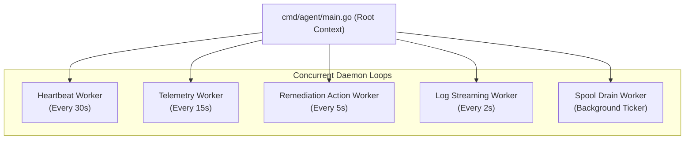
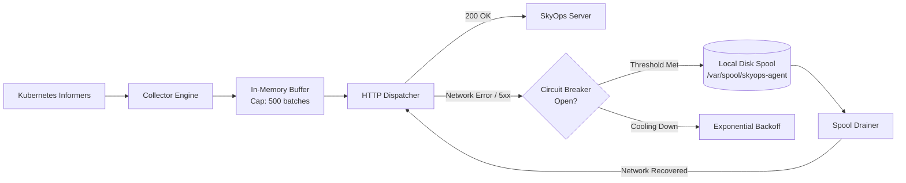
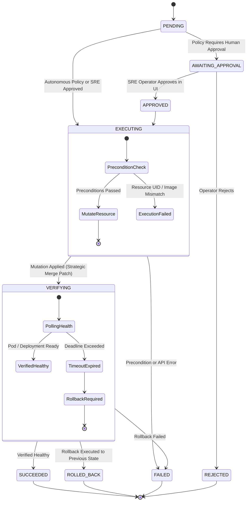

# Agent Internal Architecture

This document explains the internal design of the **SkyOps Agent (`skyops-agent` v1.5.0)**, detailing its concurrent worker loops, telemetry pipeline, disk spooling mechanism, remediation executor, and log collection engine.

---

## Agent Package Layout

The agent codebase is organized under `agent/` with clear separation of concerns:

```
agent/
├── cmd/
│   └── agent/
│       └── main.go               # Entry point: signal handling, config load, worker startup
├── internal/
│   ├── agent/
│   │   └── agent.go              # Master daemon orchestrator, lifecycle loops
│   ├── collector/
│   │   ├── collector.go          # K8s Informers & resource state extractors
│   │   └── types.go              # Internal telemetry models
│   ├── config/
│   │   └── config.go             # Environment parsing, defaults, validation
│   ├── logs/
│   │   └── collector.go          # On-demand pod log fetcher (RESTClient CoreV1)
│   ├── metrics/
│   │   └── client.go             # Metrics-server (metrics.k8s.io) scraper & fallback
│   ├── remediation/
│   │   ├── manager.go            # Action poll loop & result dispatcher
│   │   ├── executor.go           # Strategic Merge Patch, Pod recreation, rollback
│   │   ├── statemachine.go       # Action lifecycle state machine
│   │   └── types.go              # Action payloads & precondition models
│   ├── spool/
│   │   └── spool.go              # Persistent local disk buffer (/var/spool)
│   └── transport/
│       ├── client.go             # Outbound HTTP client, circuit breaker, retry backoff
│       └── types.go              # Wire payloads (TelemetryPayload, Heartbeat)
```

---

## Concurrency & Goroutine Architecture

When the agent starts, `main.go` initializes shared dependencies (Kubernetes client-go, HTTP transport, disk spooler) and launches five concurrent goroutines managed via a root `context.Context`:



### 1. Heartbeat Loop
- Dispatches a lightweight payload containing cluster ID, agent version, hostname, Kubernetes server version, node count, and pod count.
- Confirms agent-to-server health and refreshes the cluster's `lastHeartbeatAt` timestamp.
- If the control plane receives no heartbeats for > 90 seconds, the cluster transitions to `STALE` and subsequently `OFFLINE`.

### 2. Telemetry Loop
- Scrapes full Kubernetes cluster state across all included namespaces.
- Ingests CPU and memory metrics from `metrics.k8s.io/v1beta1` (falling back to container resource request/limit specs if metrics-server is unavailable).
- Collects warning and lifecycle events emitted in the last scrape window.
- Assembles a `TelemetryPayload` and passes it to the `transport.Client`.

### 3. Action Worker
- Periodically queries the control plane for queued remediation actions designated for this `ClusterID`.
- Passes retrieved actions into the `remediation.Manager` which validates pre-conditions, mutates resources, verifies convergence, and executes automatic rollback upon failure.

### 4. Log Worker
- Polls `/api/v1/agent/logs/requests` for on-demand log requests created when an SRE inspects an incident or pod in the SkyOps console.
- Directly invokes the Kubernetes Pod log subresource API (`k8sClient.CoreV1().Pods(ns).GetLogs(...)`).
- Streams captured lines back to `/api/v1/agent/logs`.

---

## Telemetry Pipeline & Local Disk Spooling

To guarantee telemetry resilience during transient network disconnects or control plane restarts, the agent implements a **Spool & Forward** architecture:



### Spooling Guarantees:
1. **Zero Memory Bloat:** The in-memory buffer is strictly capped (`SKYOPS_QUEUE_CAPACITY`, default 500 items). Surplus items spill directly to disk.
2. **Atomic Disk Appends:** Spool records are serialized to individual timestamped binary/json files under `/var/spool/skyops-agent`.
3. **Hard Ceiling (`SKYOPS_SPOOL_MAX_BYTES`):** The spool directory is restricted (default 50MB). If full, the oldest unacknowledged snapshots are purged first to preserve node stability.

---

## Remediation Execution State Machine

Automated cluster remediation follows a rigorous safety-first state machine:



### Supported Mutation Types:
1. **`ReplacePodImage` (`agent/internal/remediation/executor.go`):**
   - **Target: Deployment:** Applies a strategic merge patch to `spec.template.spec.containers[x].image`.
   - **Target: Pod (Standalone):** Deletes and recreates the pod with the updated image specification.
   - **Rollback:** Reverts `image` back to the pre-execution string recorded during `PreconditionCheck`.

2. **`RestartPod` (`agent/internal/remediation/executor.go`):**
   - **Target: Deployment:** Patches annotation `kubectl.kubernetes.io/restartedAt` with RFC3339 timestamp, triggering a standard rolling update.
   - **Target: Pod:** Directly issues `DELETE` against the pod, allowing the governing ReplicaSet/DaemonSet controller to spin up a clean instance.

3. **`ScaleDeployment` (`agent/internal/remediation/executor.go`):**
   - Applies a strategic merge patch modifying `spec.replicas`.
   - **Rollback:** Restores `replicas` to the recorded pre-action count if pods fail to ready up within the verification timeout.
