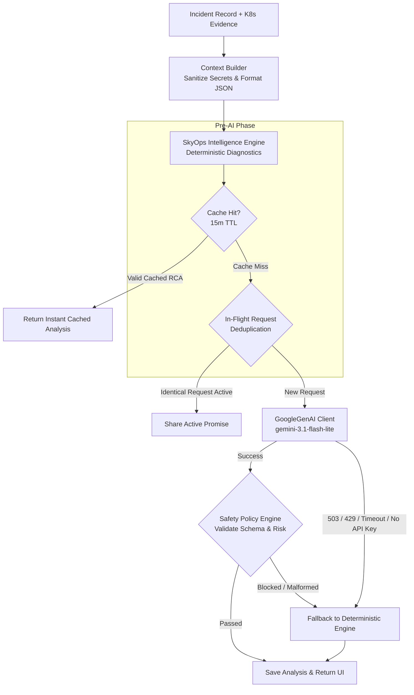

# Gemini AI Root Cause Intelligence

This document details the architecture, models, safety policies, context sanitization, and fallback mechanisms of the **SkyOps AI Analysis Service** (`server/ai/*`).

---

## AI Architecture & Philosophy

SkyOps integrates Google Gemini models via the official `@google/genai` SDK to deliver automated incident diagnosis, blast radius analysis, and natural-language remediation guidance.



---

## Model Selection & Timeout Strategy

The AI provider (`server/ai/providers/geminiProvider.ts`) implements a resilient multi-model fallback chain:

- **Primary Model:** `gemini-3.1-flash-lite` (or custom model specified via `GEMINI_MODEL`).
- **Candidate Fallback Model:** `gemini-3.8-flash`.
- **Request Timeout:** `15,000ms` (15 seconds) per model attempt.
- **Global Timeout:** `25,000ms` (25 seconds) total before aborting to deterministic fallback.
- **SDK:** Modern `@google/genai` library with structured JSON schema output (`responseMimeType: "application/json"`).

---

## Context Builder & Token Sanitization

Raw Kubernetes manifests and pod logs can easily exceed LLM token windows and leak sensitive credentials. The `buildIncidentContext` engine (`server/ai/contextBuilder.ts`) enforces strict sanitization:

1. **Secret & Env Stripping:** Strips passwords, tokens, API keys, and environment variables matching sensitive patterns (`*TOKEN*`, `*KEY*`, `*SECRET*`, `*PASSWORD*`).
2. **Log Windowing:** Takes at most the last 50 relevant log lines from the crashing container.
3. **Event Compression:** Groups duplicate events by reason and reports occurrence counts rather than repeating full event messages.
4. **Deterministic Guidance:** Injects pre-calculated metrics (e.g. `memoryUsagePercentage`, `overcommitRatio`) as baseline ground truth to prevent AI calculation hallucinations.

---

## Safety Policy Engine (`server/ai/safetyPolicy.ts`)

LLM responses are never accepted blindly into the SkyOps control plane. The `SafetyPolicyEngine` evaluates the raw generated output before returning it to the user:

- **Schema Validation:** Verifies that all required fields (`summary`, `rootCause`, `confidence`, `blastRadius`, `recommendedRemediation`, `riskLevel`) exist and match typed enums.
- **Risk Level Bounds:** Validates risk classification (`LOW`, `MEDIUM`, `HIGH`, `CRITICAL`).
- **Forbidden Actions:** Rejects any suggestion recommending unverified cluster operations (such as deleting namespaces or wiping persistent volume claims).
- **Remediation Alignment:** Ensures the proposed action matches an authorized agent remediation type (`ReplacePodImage`, `RestartPod`, `ScaleDeployment`).

---

## Deterministic Fallback Mode

If no `GEMINI_API_KEY` is configured, or if the Gemini API is temporarily unreachable (HTTP 503, 429 Rate Limit, or deadline exceeded):

- **Zero Downtime:** The SkyOps UI does not crash or display an error dialog.
- **Instant Fallback:** The system serves authoritative diagnostics generated by `SkyOpsIntelligenceEngine.analyzeIncident()`:
  - Generates deterministic root causes (e.g. *"Image pull failed due to missing Docker registry credentials (HTTP 401 Unauthorized)"*).
  - Identifies blast radius and dependent services.
  - Flags the analysis badge as `DETERMINISTIC_FALLBACK` for operator transparency.

---

## API Endpoints for AI Analysis

### Trigger or Fetch Root Cause Analysis
```http
POST /api/v1/incidents/:id/ai-analysis
Authorization: Bearer <user-jwt>
Content-Type: application/json

{
  "force": false
}
```

#### Response Example (200 OK)
```json
{
  "status": "COMPLETED",
  "model": "gemini-3.1-flash-lite",
  "generatedAt": 1726561500000,
  "confidence": "HIGH",
  "summary": "Container 'api' in Pod 'billing-service-7f6d97c76-ab12' crashed on startup due to a malformed configuration property.",
  "rootCause": "The application process exited with code 1 after failing to parse environment variable 'DATABASE_PORT' as an integer.",
  "blastRadius": {
    "affectedWorkloads": ["billing-service"],
    "dependentServices": ["checkout-service", "frontend"],
    "severity": "HIGH"
  },
  "recommendedRemediation": {
    "actionType": "ReplacePodImage",
    "description": "Deploy hotfix image 'billing-service:v2.1.4' which contains configuration validation patch.",
    "riskLevel": "LOW"
  }
}
```
