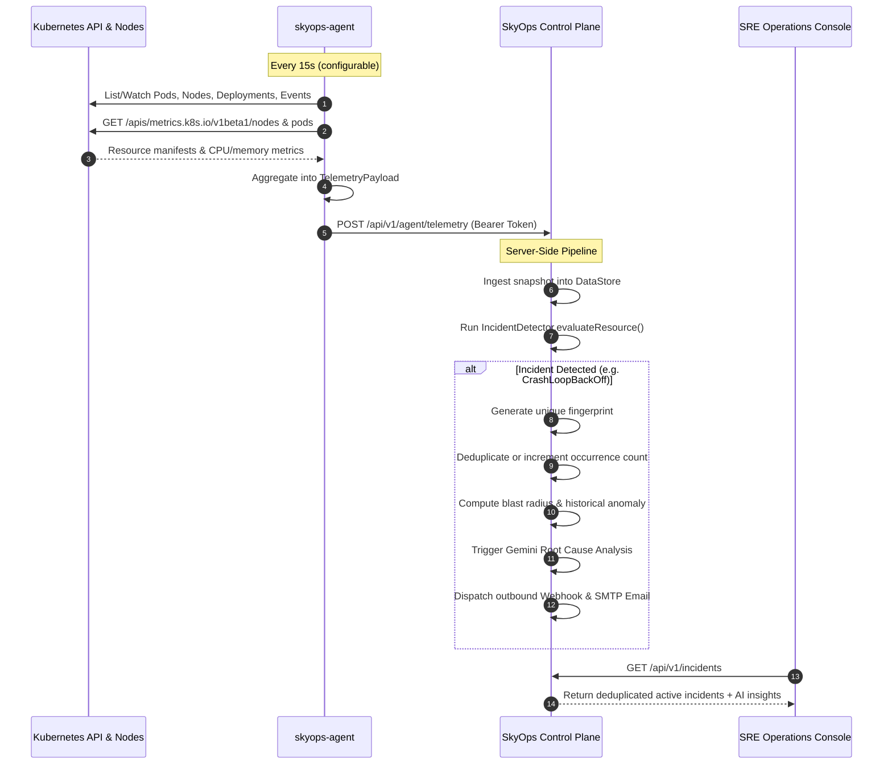

# Architecture & System Design

This document details the architectural design, communication protocols, trust boundaries, and data pipelines of the SkyOps platform.

---

## High-Level Architecture Overview

SkyOps is architected on an **outbound-only telemetry model**. The SkyOps Agent deployed inside target Kubernetes clusters initiates all connections out to the SkyOps Central Control Plane over standard HTTP/HTTPS.

**Key Security Advantage:** Target clusters never require open ingress ports, public IP addresses, or inbound firewall exceptions. SkyOps functions securely inside air-gapped VPCs, private AWS EKS clusters, Google Cloud private GKE, Azure AKS, on-premises bare-metal, and developer environments (Kind, Minikube, K3s).

```mermaid
graph TB
    subgraph K8sCluster["Target Kubernetes Cluster (Private VPC)"]
        subgraph AgentPod["SkyOps Agent Pod (skyops-system)"]
            Informer["K8s API Informers<br/>(Pods, Deployments, Nodes, PVCs, Events)"]
            MetricsClient["Metrics Server Client<br/>(metrics.k8s.io)"]
            Spool["Local Disk Spooler<br/>(/var/spool/skyops-agent)"]
            Dispatcher["Telemetry & Heartbeat Dispatcher"]
            Executor["Remediation Executor<br/>(Strategic Merge Patch, Rollback)"]
            LogStreamer["Pod Log Collector<br/>(RESTClient corev1.Pod.GetLogs)"]
        end
        K8sAPIServer["kube-apiserver (Internal)"]
    end

    subgraph ControlPlane["SkyOps Control Plane (Node.js / TypeScript)"]
        APIRoutes["Express API Router (/api/v1/*)"]
        AuthMiddleware["Agent & User Auth Middleware<br/>(Bearer Token & Firebase JWT)"]
        Store["Authoritative DataStore<br/>(Thread-Safe + Local JSON Persistence)"]
        Detector["Deterministic Incident Detector<br/>(Rule Evaluation & Fingerprinting)"]
        Intelligence["Intelligence & Baseline Engine<br/>(Anomalies, Blast Radius)"]
        AIService["AI Root Cause Service<br/>(Google GenAI Gemini 3.1 & 3.8)"]
        ActionLease["Remediation Policy & Lease Engine"]
        Notifiers["Alerting Engine<br/>(Nodemailer SMTP & Webhook Dispatcher)"]
    end

    subgraph ClientUI["Client Web Layer"]
        SPA["SkyOps Operations Console<br/>(React 19 + Tailwind CSS)"]
    end

    %% Kubernetes Internal Connections
    K8sAPIServer <-->|Watch / Get / List| Informer
    K8sAPIServer <-->|GET /apis/metrics.k8s.io| MetricsClient
    K8sAPIServer <-->|Patch / Delete / Create| Executor
    K8sAPIServer <-->|GET /api/v1/namespaces/{ns}/pods/{name}/log| LogStreamer

    %% Internal Agent Connections
    Informer --> Spool
    MetricsClient --> Spool
    Spool --> Dispatcher

    %% Outbound Connections to Control Plane
    Dispatcher -->|POST /api/v1/agent/heartbeat| APIRoutes
    Dispatcher -->|POST /api/v1/agent/telemetry| APIRoutes
    Dispatcher -->|GET /api/v1/agent/actions| APIRoutes
    Dispatcher -->|POST /api/v1/agent/actions/{id}/result| APIRoutes
    LogStreamer -->|POST /api/v1/agent/logs| APIRoutes

    %% Control Plane Internal Flow
    APIRoutes --> AuthMiddleware
    AuthMiddleware --> Store
    Store --> Detector
    Detector --> Intelligence
    Intelligence --> AIService
    Intelligence --> Notifiers
    ActionLease <--> Store

    %% UI Connections
    SPA <-->|REST API + Bearer Token| APIRoutes
```

---

## Core Subsystems

### 1. The SkyOps Agent (`skyops-agent` v1.5.0)

Written in Go, the agent is compiled into a lightweight scratch/alpine container image. It runs with restricted privileges under the `skyops-agent` ServiceAccount.

The agent consists of several concurrent internal loops:
- **Heartbeat Worker (`agent/internal/agent/agent.go`):** Dispatches periodic heartbeats (default every `30s`) to inform the control plane of cluster liveness, Kubernetes version, node count, and resource capacity.
- **Telemetry Worker:** Gathers snapshot data from informers and metrics APIs (default every `15s`) and pushes batches to `/api/v1/agent/telemetry`.
- **Action Poller (`agent/internal/remediation/manager.go`):** Polls `/api/v1/agent/actions` (default every `5s`) for approved remediation operations.
- **Log Request Poller (`agent/internal/logs/collector.go`):** Polls `/api/v1/agent/logs/requests` (default every `2s`) for on-demand pod log collection requests from SRE operators.
- **Disk Spooler (`agent/internal/spool/spool.go`):** If network connectivity to the control plane is disrupted, unsent telemetry records are serialized to `/var/spool/skyops-agent` (up to `50MB` default) to prevent memory ballooning and avoid telemetry loss during transient network blips.

### 2. The Control Plane Server (`server.ts` & `server/*`)

The central management server is an Express.js service written in TypeScript. It coordinates telemetry processing, incident management, user authorization, and remediation pipelines.

- **Authoritative DataStore (`server/store.ts`):** In-memory transactional data store that manages clusters, telemetry points, incidents, action queues, organizations, users, webhooks, and audit logs.
- **Persistence Layer (`server/persistence.ts`):** Periodically writes DataStore state atomically to disk via temporary file rename (`.tmp` to `.json`). By default, stores files in `./data/` (in development) or in the directory specified by `SKYOPS_DATA_DIR` (mandatory in production).
- **Incident Engine (`server/engine/detector.ts`):** Evaluates incoming telemetry snapshots deterministically against codified Kubernetes failure patterns. Assigns consistent hashes (`fingerprints`) to ensure incidents are deduplicated rather than duplicated across consecutive scrape cycles.
- **Intelligence Engine (`server/engine/intelligence.ts`):** Analyzes historical resource usage, establishes rolling baselines, detects anomalous deviations (e.g. CPU spikes > 2.5 standard deviations, rapid memory increases pointing to leaks), and correlates secondary impact across namespaces.
- **AI Analysis Service (`server/ai/service.ts`):** Calls Google Gemini models via `@google/genai` to analyze incident context, container diagnostics, recent events, and pod logs. The output is structured and validated against strict safety rules before being delivered to the UI.

---

## Telemetry Data Flow



---

## Security Model & Trust Boundaries

### Agent Authentication
Every agent deployment is issued a unique cluster token (`skyops_at_...`). The agent includes this token in the `Authorization: Bearer <token>` header on every request. The server authenticates the token, verifies the cluster association, and checks agent version compatibility (`x-skyops-agent-version`).

### User Authentication & RBAC
User access to the control plane is secured via Firebase Authentication:
- The client acquires a Firebase ID token.
- The server validates the token against Google's public x509 certificates.
- Multi-tenancy is strictly enforced: users can only access clusters, incidents, and audit trails belonging to their active organization.
- Role-Based Access Control enforces granular permissions across five tiers: **OWNER**, **ADMIN**, **OPERATOR**, **ENGINEER**, and **VIEWER**.

### Remediation Safety & Leases
Remediation actions cannot execute unchecked:
1. **Cluster Leases:** The control plane enforces a mutual exclusion lease per cluster/namespace to prevent conflicting concurrent mutations.
2. **Pre-condition Validation:** The agent validates that the target resource exists and matches the expected UID, image, or replica count before applying changes.
3. **Automatic Rollback:** If the target does not achieve the expected healthy state within the verification window, the agent automatically rolls back the mutation to the previous state.
