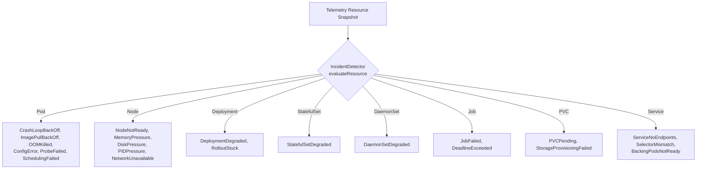

# Deterministic Incident Detection Engine

This document details the architecture, evaluation rules, resource categories, and fingerprinting mechanisms of the SkyOps **Deterministic Incident Detection Engine** (`server/engine/detector.ts`).

---

## Core Philosophy: Determinism Over Non-Deterministic AI

Many modern observability platforms rely on LLMs to decide whether an incident exists. SkyOps explicitly rejects this pattern for alert triggering:

- **100% Deterministic Rule Engine:** Incident detection is purely mathematical, heuristic, and rule-based. Every alert is traceable to concrete Kubernetes API objects, container exit codes, conditions, and event messages.
- **Zero AI Hallucinations in Alerting:** AI models are strictly reserved for post-detection root-cause analysis and natural-language summarization; they never create, modify, or resolve incidents directly.
- **Sub-Second Evaluation:** The engine evaluates hundreds of resources per scrape cycle with minimal CPU latency.

---

## Evaluated Resource Types & Incident Catalog

The engine inspects eight core Kubernetes resource kinds across 35+ failure modes:

### 1. Pod Workload Failures

| Incident Type | Severity | Detection Trigger & Condition |
| :--- | :--- | :--- |
| **`CrashLoopBackOff`** | `HIGH` | Container `state.waiting.reason == "CrashLoopBackOff"` or restart count $\ge 3$ within 10 minutes. |
| **`OOMKilled`** | `HIGH` | Container `lastTerminationReason == "OOMKilled"` or exit code `137`. |
| **`ImagePullBackOff`** | `HIGH` | Container waiting reason is `ImagePullBackOff` or `ErrImagePull`. |
| **`CreateContainerConfigError`**| `MEDIUM` | Container failed to start due to missing ConfigMap or Secret reference. |
| **`ReadinessProbeFailed`** | `MEDIUM` | Container running but `ready == false` with repeated readiness probe failure events. |
| **`LivenessProbeFailed`** | `HIGH` | Unhealthy events logged; kubelet restarting container due to failed liveness probe. |
| **`PodSchedulingFailed`** | `HIGH` | Pod `phase == "Pending"` with event `FailedScheduling` (e.g. 0/N nodes available). |
| **`VolumeMountFailed`** | `HIGH` | Pod stuck in `ContainerCreating` with `FailedMount` or `FailedAttachVolume` events. |

### 2. Node Infrastructure Failures

| Incident Type | Severity | Detection Trigger & Condition |
| :--- | :--- | :--- |
| **`NodeNotReady`** | `CRITICAL` | Node condition `Ready.status != "True"` for $\ge 30$ seconds. |
| **`NodeMemoryPressure`** | `HIGH` | Node condition `MemoryPressure.status == "True"`. |
| **`NodeDiskPressure`** | `HIGH` | Node condition `DiskPressure.status == "True"`. |
| **`NodePIDPressure`** | `HIGH` | Node condition `PIDPressure.status == "True"`. |

### 3. Controller & Service Failures

| Incident Type | Severity | Detection Trigger & Condition |
| :--- | :--- | :--- |
| **`DeploymentDegraded`** | `HIGH` | `availableReplicas < desiredReplicas` sustained across scrape cycles. |
| **`StatefulSetDegraded`**| `HIGH` | `readyReplicas < replicas` for StatefulSet controller. |
| **`DaemonSetDegraded`** | `HIGH` | `numberReady < desiredNumberScheduled` across eligible nodes. |
| **`JobFailed`** | `MEDIUM` | Batch Job reached `backoffLimit` or exceeded `activeDeadlineSeconds`. |
| **`ServiceNoEndpoints`** | `HIGH` | Active Service has 0 healthy Endpoints / EndpointSlice records. |
| **`ServiceSelectorMismatch`** | `MEDIUM` | Service selector labels match zero active pods in the namespace. |

---

## Agent Infrastructure Self-Exclusion

A critical rule implemented in `IncidentDetector.isAgentInfrastructure(resource)` guarantees that SkyOps telemetry agents never generate spurious incidents for themselves:

- Resources in namespaces `skyops-system` or `skyops` are excluded.
- Workloads prefixed with `skyops-agent` or holding label `app.kubernetes.io/name: skyops-agent` are excluded.
- Agent liveness is monitored strictly via the dedicated heartbeat mechanism, preventing telemetry loops or recursive incident alerts.

---

## Deduplication & Fingerprinting

To prevent alert storms and duplicate notification emails, every detected anomaly is hashed into a deterministic **Fingerprint**:

$$\text{Fingerprint} = \text{SHA256}(\text{ClusterID} + \text{Namespace} + \text{ResourceKind} + \text{ResourceName} + \text{IncidentType})$$

### Occurrence Lifecycle Logic:
1. **First Discovery:** Incident record created (`id: SKY-0001`, `occurrenceCount: 1`, `status: OPEN`).
2. **Subsequent Scrapes (Still Failing):** The engine matches the active fingerprint. `lastSeenAt` is updated; no new ticket or notification is generated.
3. **Recovery:** The workload recovers (`ready == true`). The incident is automatically marked `RESOLVED`.
4. **Recurrence (Flapping Workload):** If the workload crashes again in the future:
   - The original ticket transitions back to `OPEN`.
   - `occurrenceCount` increments from `1` to `2`.
   - A timeline entry is recorded: `Incident recurred (Occurrence #2)`.
