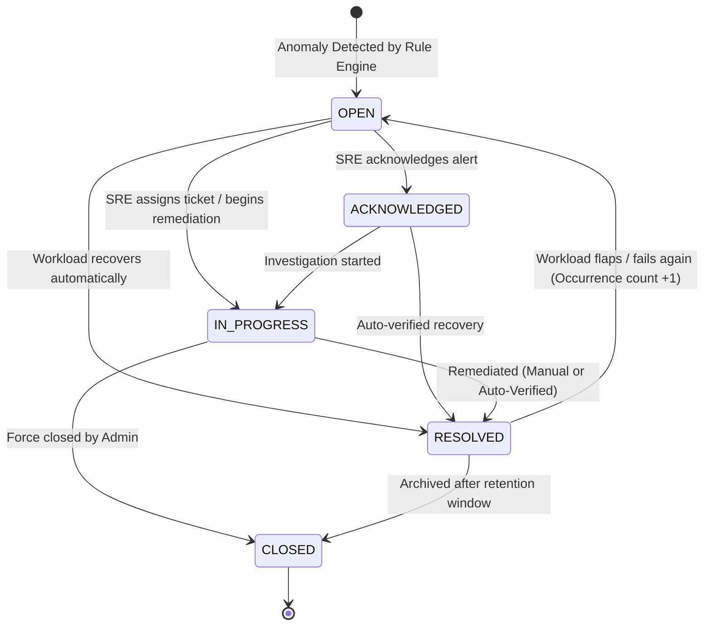

# Incident Lifecycle & Triage

This document covers the end-to-end incident lifecycle in SkyOps, including status progression, triage workflows, timeline auditing, team collaboration, resolution verification, and post-incident reporting.

---

## Incident State Machine

Every incident tracked by SkyOps transitions through standardized lifecycle states:



### Status Descriptions

| Status | Meaning | Typical Operator Action |
| :--- | :--- | :--- |
| **`OPEN`** | Active failure detected in cluster. Unacknowledged by team. | Review root cause, check blast radius, assign responder. |
| **`ACKNOWLEDGED`** | An operator has seen the alert and silenced further paging. | Inspect pod logs and historical telemetry anomalies. |
| **`IN_PROGRESS`** | Active investigation or remediation in flight. | Execute proposed remediation action (`ReplacePodImage`, `RestartPod`). |
| **`RESOLVED`** | The resource has returned to a fully healthy state. | Review post-incident timeline; download incident report. |
| **`CLOSED`** | Ticket finalized and archived. | Periodic audit or SRE post-mortem review. |

---

## Triage & Collaboration Tools

### 1. Assignee Management
Incidents can be assigned to active organization members (`requireRole(['OWNER', 'ADMIN', 'OPERATOR', 'ENGINEER'])`):
```http
PATCH /api/v1/incidents/:id/status
{
  "assigneeUserId": "user-alex-123"
}
```

### 2. SRE Investigation Notes
Operators can append timestamped markdown notes to document remediation steps, hypotheses, and communication logs:
- Add Note: `POST /api/v1/incidents/:id/notes`
- List Notes: `GET /api/v1/incidents/:id/notes`
- Delete Note: `DELETE /api/v1/incidents/:id/notes/:noteId`

### 3. Chronological Incident Timeline
SkyOps maintains an immutable chronological audit trail for every incident:
- `DETECTION`: Exact millisecond when the anomaly was first recorded.
- `OCCURRENCE_INCREMENT`: Timestamps for recurring crash loops.
- `NOTE_ADDED`: SRE comments and investigation findings.
- `AI_ANALYSIS_GENERATED`: AI root-cause report generated.
- `REMEDIATION_PROPOSED`: Remediation action queued.
- `REMEDIATION_EXECUTED`: Agent mutated cluster resource.
- `AUTO_RESOLVED`: Cluster telemetry verified healthy status.

Inspect via:
```http
GET /api/v1/incidents/:id/timeline
```

---

## Resolution Verification: Automatic vs. Manual

### 1. Automatic Verified Resolution (`AUTOMATIC_VERIFIED`)
SkyOps continuously monitors affected workloads during subsequent scrape cycles. If:
- Pod containers transition from `Waiting`/`Terminated` to `Running` with `Ready: true`.
- Restart count stabilizes and exit code returns `0`.
- Deployment `availableReplicas == desiredReplicas`.

The control plane automatically transitions the incident to `RESOLVED` with:
```json
{
  "resolution": {
    "source": "AUTOMATIC_VERIFIED",
    "resolvedAt": 1726561200000,
    "reason": "Cluster telemetry verified all container replicas in Running state with passing readiness probes."
  }
}
```

### 2. Manual Resolution (`MANUAL`)
An SRE operator can manually resolve an incident after performing external cluster modifications:
```http
POST /api/v1/incidents/:id/resolve
{
  "reason": "Updated secret credentials and re-triggered deployment rollout manually via kubectl."
}
```

---

## Post-Incident PDF Report Export

For compliance and blameless post-mortem meetings, SkyOps includes a client-side PDF export engine powered by `jspdf`:
1. Navigate to the Incident Details page.
2. Click **Export Post-Mortem Report**.
3. Generates an executive summary containing:
   - Priority level (P1 - P5 mapping).
   - Time to Detect (TTD) and Mean Time to Resolve (MTTR).
   - Gemini AI Root Cause Analysis summary.
   - Complete chronological timeline of events and actions taken.
