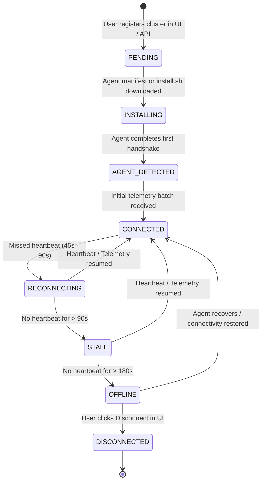
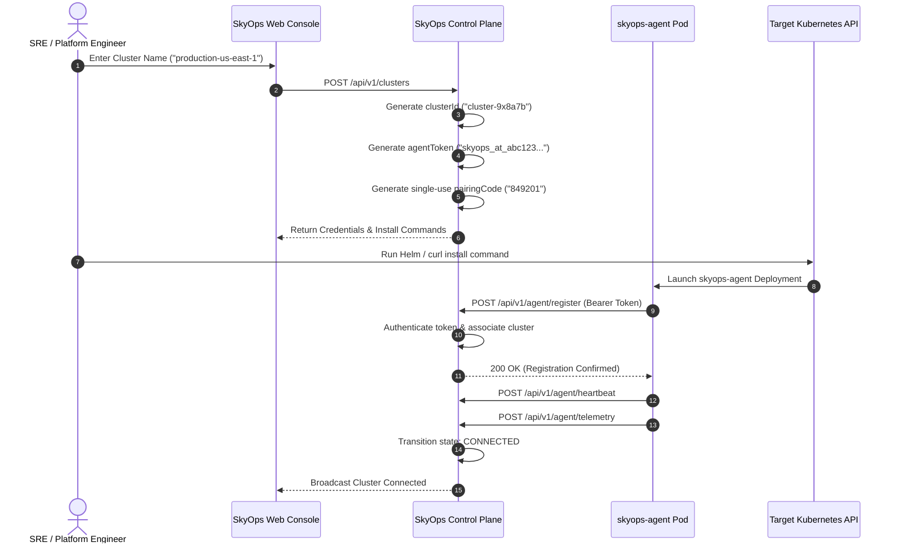

# Cluster Connection & Lifecycle

This document explains the onboarding protocol, connection state machine, cryptographic token lifecycle, and health heartbeats between the SkyOps Agent and the Control Plane.

---

## Connection Lifecycle State Machine

When a Kubernetes cluster is enrolled into SkyOps, it transitions through well-defined connection states managed by `server/store.ts`:



### State Definitions

| Connection State | UI Badge | Condition | Automatic Action |
| :--- | :--- | :--- | :--- |
| **`pending`** | Gray | Cluster entity created; awaiting initial agent contact. | Installation instructions rendered in UI. |
| **`installing`** | Blue Pulse | Install script or Helm manifest requested via API. | Awaiting agent daemon container startup. |
| **`agent_detected`** | Amber | Agent contacted `/api/v1/agent/register` or heartbeat. | Validating version compatibility. |
| **`connected`** | Green Pulse | Active heartbeats and telemetry received within 45s. | Normal observability and incident detection. |
| **`reconnecting`** | Yellow | No heartbeat received between 45s and 90s. | UI warning displayed; telemetry assumed delayed. |
| **`stale`** | Orange | No heartbeat received between 90s and 180s. | Incident engine pauses automated resolution. |
| **`offline`** | Red | No heartbeat received for > 180s (3 minutes). | SRE notified; cluster marked degraded. |
| **`disconnected`** | Gray | Operator explicitly severed connection in UI. | Agent token permanently revoked. |

---

## The Onboarding Protocol



---

## Token Authentication & Security Lifecycle

### 1. Token Structure
Every cluster is issued a secure cryptographic bearer token prefixed with `skyops_at_`:
- Length: 48 alphanumeric characters.
- Stored hashed or securely indexed in the control plane DataStore.
- Injected into the target cluster as a Kubernetes Secret (`skyops-agent-credentials`).

### 2. Token Verification
On every HTTP call from the agent:
1. The server's `requireAgentAuth` middleware inspects `Authorization: Bearer <token>`.
2. It resolves the token to the associated `clusterId` and tenant `orgId`.
3. If valid, the request proceeds with `req.clusterId` bound to the context.
4. If revoked or unknown, the server responds with `403 Forbidden`.

### 3. Token Rotation
Security compliance often mandates periodic secret rotation. SkyOps supports zero-downtime token rotation via the API or UI:

```bash
curl -X POST \
  -H "Authorization: Bearer <user-jwt>" \
  "https://<skyops-host>/api/v1/clusters/<cluster-id>/rotate-token"
```

Response:
```json
{
  "clusterId": "cluster-9x8a7b",
  "newToken": "skyops_at_new_generated_secret_998877",
  "rotatedAt": 1726560000000
}
```

Update the Kubernetes secret in your cluster:
```bash
kubectl create secret generic skyops-agent-credentials \
  -n skyops-system \
  --from-literal=agent-token="skyops_at_new_generated_secret_998877" \
  --dry-run=client -o yaml | kubectl apply -f -

# Restart agent pod to pick up new secret
kubectl rollout restart deployment/skyops-agent -n skyops-system
```

### 4. Token Revocation
To immediately decommission a cluster or terminate an compromised agent:
```bash
curl -X POST \
  -H "Authorization: Bearer <user-jwt>" \
  "https://<skyops-host>/api/v1/clusters/<cluster-id>/revoke-token"
```
Once revoked, all subsequent calls from that agent are immediately rejected with `403 Forbidden`, preventing any further telemetry ingestion or action dispatch.

---

## Identity Stability & Pod Restarts

A common defect in naive agent implementations is creating duplicate cluster records when an agent pod restarts, crashes, or reschedules onto another node.

SkyOps guarantees **Identity Stability**:
- The agent persists its assigned `SKYOPS_CLUSTER_ID` across all pod lifecycles.
- When an agent pod restarts, it reports the existing `ClusterID` during registration.
- The control plane matches the `ClusterID` and updates the existing cluster entity rather than creating a duplicate.
- Node name changes, pod IP changes, and replica rescheduling do not affect cluster identity.
