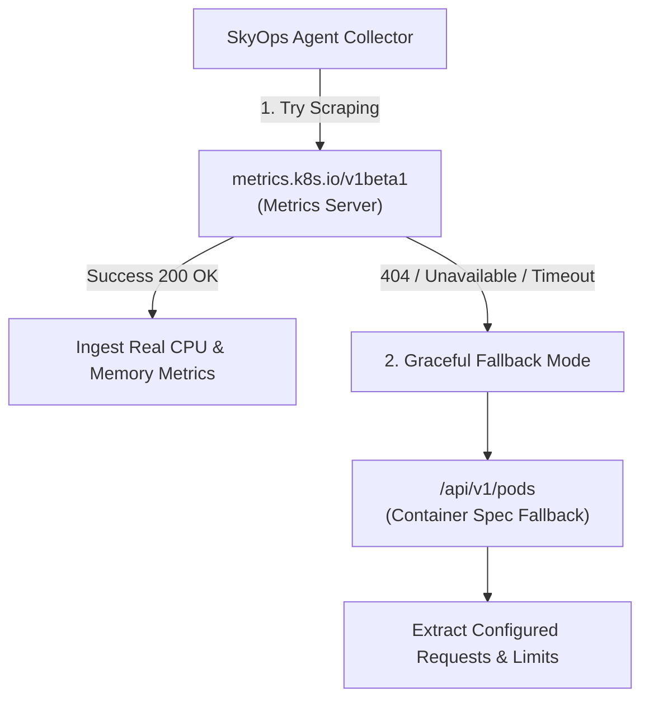

# Kubernetes Compatibility & RBAC Matrix

This document outlines the tested Kubernetes versions, cloud distribution compatibility, metrics-server prerequisites, and RBAC security specifications for SkyOps.

---

## Kubernetes Version Compatibility

The SkyOps Agent (`skyops-agent` v1.5.0) is built against modern Kubernetes client-go libraries and tested across both LTS releases and cutting-edge versions:

| Kubernetes Version | Compatibility Status | Validation Notes |
| :--- | :--- | :--- |
| **v1.35.x** | **Fully Verified** | Confirmed on active clusters (`v1.35.1`). Full support for Pod log streaming and `metrics.k8s.io/v1beta1`. |
| **v1.34.x** | **Fully Verified** | Native support for all informers and strategic merge patches. |
| **v1.33.x** | **Fully Verified** | All core workload and network resource controllers validated. |
| **v1.32.x** | **Fully Verified** | Production validated on cloud-managed distributions. |
| **v1.31.x** | **Fully Verified** | Production validated on cloud-managed distributions. |
| **v1.30.x** | **Fully Verified** | Stable support across all storage, batch, and apps controllers. |
| **v1.29.x** | **Fully Verified** | Standard production baseline. |
| **v1.28.x** | **Fully Verified** | Standard production baseline. |
| **v1.24 - v1.27**| **Supported** | Minimum supported version is Kubernetes v1.24. |
| **< v1.24** | **Deprecated / Unsupported** | Deprecated APIs (`extensions/v1beta1`, legacy metrics) may cause informer initialization failures. |

---

## Cloud Distribution Support

| Distribution | Environment Type | Status | Special Considerations |
| :--- | :--- | :--- | :--- |
| **Amazon EKS** | Managed Public / Private VPC | Supported | Works with AWS IAM Roles for Service Accounts (IRSA) or standard Secrets. Outbound HTTPS (443) required. |
| **Google Cloud GKE** | Standard & Autopilot | Supported | On GKE Autopilot, ensure default resource requests align with GKE minimum compute quotas. |
| **Azure AKS** | Managed Azure Cloud | Supported | Compatible with Azure CNI and Kubenet network plugins. |
| **Red Hat OpenShift**| Enterprise Hybrid Cloud | Supported | Requires binding `skyops-agent` ServiceAccount to the `nonroot` or `anyuid` SecurityContextConstraint (SCC). |
| **K3s / Rancher** | Edge / Lightweight | Supported | Native support for bundled metrics-server and Traefik controllers. |
| **Kind / Minikube** | Local Development | Supported | Ideal for testing. Ensure `metrics-server` addon is enabled (`minikube addons enable metrics-server`). |
| **Bare-Metal K8s** | Self-Hosted / On-Prem | Supported | Works with kubeadm, Calico, Flannel, Cilium, and kube-vip. |

---

## Metrics Server Prerequisites & Fallback

SkyOps natively integrates with the official Kubernetes [Metrics Server](https://github.com/kubernetes-sigs/metrics-server) to retrieve real-time CPU and memory usage for nodes and pods:



### Checking Metrics Server Status on Your Cluster
Run:
```bash
kubectl top nodes
kubectl top pods -A
```

If metrics-server is not installed, install the standard manifest:
```bash
kubectl apply -f https://github.com/kubernetes-sigs/metrics-server/releases/latest/download/components.yaml
```

*Note: In development clusters (Minikube / Kind) or custom TLS environments without signed kubelet certificates, metrics-server may require the `--kubelet-insecure-tls` flag.*

---

## Granular RBAC Specification

SkyOps follows the **Principle of Least Privilege**. The agent only requires read permissions for observability, with write permissions restricted strictly to Pod and Deployment mutations required for authorized remediation:

```yaml
apiVersion: rbac.authorization.k8s.io/v1
kind: ClusterRole
metadata:
  name: skyops-agent-reader
rules:
  # 1. Pods: Discovery, Lifecycle Observation, and Remediation Re-creation
  - apiGroups: [""]
    resources: ["pods"]
    verbs: ["get", "list", "watch", "create", "delete"]

  # 2. Logs: Live Streaming for Incident Root Cause Analysis
  - apiGroups: [""]
    resources: ["pods/log"]
    verbs: ["get"]

  # 3. Read-Only Core Cluster Infrastructure
  - apiGroups: [""]
    resources:
      - pods/status
      - nodes
      - nodes/status
      - namespaces
      - services
      - endpoints
      - persistentvolumeclaims
      - persistentvolumes
      - configmaps
      - secrets
      - serviceaccounts
      - resourcequotas
      - limitranges
      - events
    verbs: ["get", "list", "watch"]

  # 4. Workload Controllers: Detection & Remediation Patching
  - apiGroups: ["apps"]
    resources:
      - deployments
      - deployments/status
      - statefulsets
      - statefulsets/status
      - daemonsets
      - daemonsets/status
      - replicasets
    verbs: ["get", "list", "watch", "patch"]

  # 5. Batch Workloads
  - apiGroups: ["batch"]
    resources: ["jobs", "cronjobs"]
    verbs: ["get", "list", "watch"]

  # 6. Ingress & Storage Class Discovery
  - apiGroups: ["networking.k8s.io"]
    resources: ["ingresses"]
    verbs: ["get", "list", "watch"]
  - apiGroups: ["storage.k8s.io"]
    resources: ["storageclasses"]
    verbs: ["get", "list", "watch"]

  # 7. Metrics API Ingestion
  - apiGroups: ["metrics.k8s.io"]
    resources: ["nodes", "pods"]
    verbs: ["get", "list"]
```

---

## Security Context & Hardening Guidelines

The agent is designed to run in hardened enterprise environments under a non-root user:

```yaml
securityContext:
  allowPrivilegeEscalation: false
  readOnlyRootFilesystem: true
  runAsNonRoot: true
  runAsUser: 10001
  capabilities:
    drop:
      - ALL
```
When `readOnlyRootFilesystem: true` is enabled, an `emptyDir` volume must be mounted at `/var/spool/skyops-agent` and `/tmp` to allow spooling and ephemeral scratch writes.
