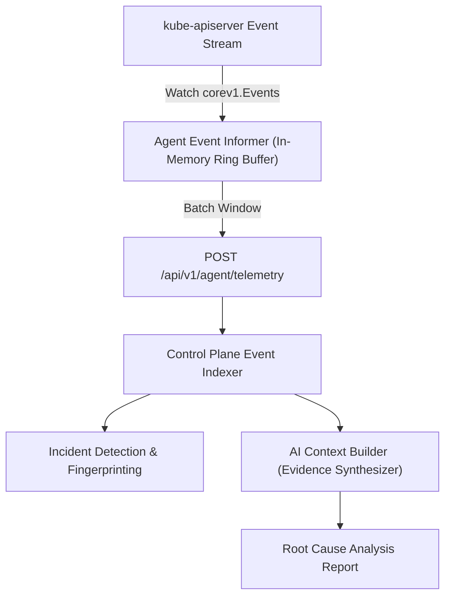

# Kubernetes Events Streaming & Correlation

This document covers how SkyOps streams, indexes, and correlates Kubernetes cluster events (`corev1.Event`), utilizing them as empirical evidence in incident detection and root cause analysis.

---

## Event Ingestion Architecture

Kubernetes Events provide chronological evidence of state changes, controller decisions, scheduling failures, container restarts, and probe failures across a cluster.

The SkyOps Agent ingests events using a dedicated informer:
- **Informer Watch:** Watches `corev1.Event` across all included namespaces.
- **Deduplication:** Aggregates recurring events based on the Kubernetes-native `involvedObject`, `reason`, `message`, and `source.component` keys.
- **Scrape Window:** Dispatches recent warning and normal events in each 15-second telemetry cycle (`/api/v1/agent/telemetry`).



---

## Event Severity Classification

SkyOps organizes cluster events into two distinct severity tiers:

### 1. Warning Events (`type: "Warning"`)
High-priority events indicating failure, contention, or degradation:
- **`BackOff` / `CrashLoopBackOff`:** Container failed repeatedly and is backing off restarts.
- **`FailedMount` / `FailedAttachVolume`:** Storage volume attachment failure.
- **`FailedScheduling`:** No nodes meet the pod's resource requests, affinity, or taints.
- **`Unhealthy`:** Liveness, readiness, or startup probe failure.
- **`FailedSync`:** Controller unable to reconcile pod or deployment specification.
- **`OOMKilled`:** Kernel OOM-killer terminated container process.

### 2. Normal Lifecycle Events (`type: "Normal"`)
Informational events used for lifecycle auditing:
- **`Scheduled`:** Pod successfully assigned to a node.
- **`Pulled` / `Pulling`:** Container image successfully pulled.
- **`Created` / `Started`:** Container successfully created or started.
- **`Killing`:** Pod gracefully terminated during scale-down or rollout.

---

## Event Correlation with Incidents

When the deterministic incident detector (`server/engine/detector.ts`) identifies a degraded workload, it correlates all recent events associated with that resource's `UID` and `name`:

1. **Evidence Binding:** Events matching the resource are attached directly to the incident record (`incident.technicalDetails.events`).
2. **First & Last Seen Sync:** The incident's `firstSeenAt` and `lastSeenAt` timestamps align with the event timeline.
3. **AI Context Injection:** When generating AI root-cause analysis, the event stream is sanitized and passed into the prompt as deterministic ground truth.

---

## API Specification for Events

### Query Cluster Events
```http
GET /api/v1/clusters/:id/events?namespace=production&type=Warning&limit=50
Authorization: Bearer <user-jwt>
```

#### Query Parameters:
- `namespace` (optional): Filter events by namespace.
- `type` (optional): Filter by `Warning` or `Normal`.
- `reason` (optional): Filter by event reason (e.g. `FailedScheduling`).
- `search` (optional): Free-text search matching event message or involved object name.
- `limit` (optional): Maximum events returned (default `50`, max `200`).

#### Response Example (200 OK)
```json
{
  "total": 2,
  "events": [
    {
      "id": "evt-89ab7c",
      "type": "Warning",
      "reason": "FailedScheduling",
      "message": "0/3 nodes are available: 3 Insufficient memory.",
      "involvedObject": {
        "kind": "Pod",
        "namespace": "production",
        "name": "payment-processor-5d8f76d9-ab12c"
      },
      "firstSeen": "2026-09-17T08:14:10Z",
      "lastSeen": "2026-09-17T08:14:55Z",
      "count": 4,
      "source": "default-scheduler"
    }
  ]
}
```
