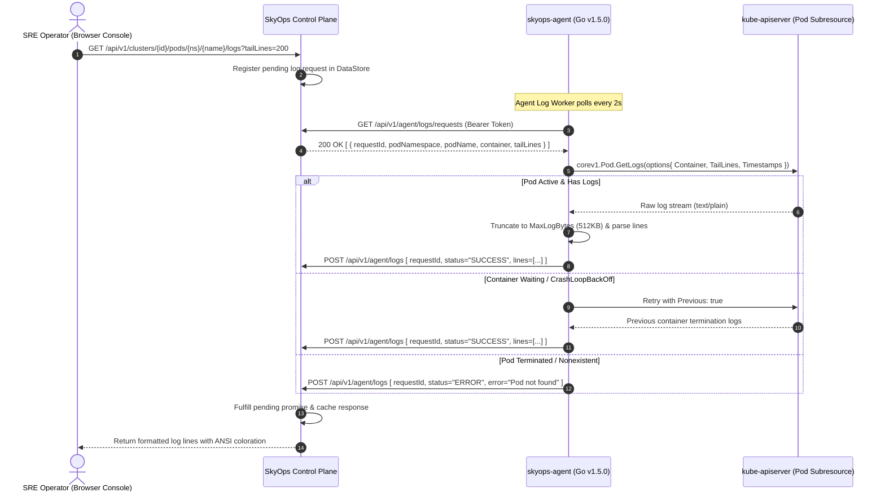

# Pod Log Streaming Pipeline

This document details the on-demand pod log streaming pipeline in SkyOps, explaining how log requests originate in the UI, flow through the control plane, are collected by the Go agent via the Kubernetes API, and return to the operator.

---

## On-Demand Log Streaming Architecture

Unlike traditional heavyweight log forwarders (Fluentd, Vector, Promtail) that ingest 100% of cluster stdout/stderr into high-cost centralized storage, SkyOps employs an **On-Demand Streaming Pipeline**:

- Zero background ingestion overhead: Logs are only fetched when an SRE opens an incident investigation or inspects a pod in the console.
- Native Kubernetes API integration: The agent interacts directly with the `kube-apiserver` subresource `/api/v1/namespaces/{namespace}/pods/{pod}/log`.
- Strict bandwidth & buffer limits: Tail lines are capped (`250` lines default), and payloads are bounded (`512KB` ceiling) to avoid memory spikes.



---

## Log Request Lifecycle & Timeout Handling

### 1. Request Creation
When an SRE opens the Pod Logs modal or clicks **View Logs** on an incident:
- The frontend issues `GET /api/v1/clusters/:id/pods/:namespace/:podName/logs`.
- The server creates a `LogCollectionRequest` with a unique UUID.
- The HTTP request remains open with a **10-second timeout** waiting for the agent response.

### 2. Agent Retrieval Loop (`agent/internal/logs/collector.go`)
- The agent's `logCollector` polls `/api/v1/agent/logs/requests` every **2 seconds** (`SKYOPS_LOG_POLL_INTERVAL`).
- Upon receiving a request, it creates an execution context with a deadline (`SKYOPS_LOG_REQUEST_TIMEOUT`, default `10s`).
- It initiates a stream via `client-go`:
  ```go
  req := k8sClient.CoreV1().Pods(reqPayload.Namespace).GetLogs(reqPayload.PodName, &corev1.PodLogOptions{
      Container:  reqPayload.Container,
      TailLines:  &tailLines,
      Timestamps: true,
      Previous:   reqPayload.Previous,
  })
  readCloser, err := req.Stream(ctx)
  ```

### 3. Payload Safeguards
- **Max Tail Lines:** Configurable via `SKYOPS_MAX_LOG_TAIL_LINES` (default `250`). Capped at 1,000 lines.
- **Max Payload Size:** Bounded by `SKYOPS_MAX_LOG_BYTES` (default `524,288` bytes / 512KB). If a log line causes the buffer to exceed this limit, reading halts cleanly with a trailing truncation indicator: `"[SkyOps Notice: Log stream truncated at 512KB limit]"`.
- **Sensitive Token Sanitization:** The agent regex-strips obvious credential tokens (e.g. AWS access keys, Bearer tokens, private keys) before serializing logs to the control plane.

---

## Diagnostic Scenarios & Previous Container Logs

When diagnosing crash incidents (such as `CrashLoopBackOff` or `OOMKilled`), the currently running container may be newly started and contain no logs, while the crashed container's logs hold the critical stack trace.

### Automatic Fallback:
1. The agent first queries the live container log stream.
2. If the live stream returns zero lines and the container's restart count is $\ge 1$, the agent automatically executes a secondary request with `Previous: true` (`kubectl logs -p`).
3. If previous logs are discovered, the output is tagged with a badge: `[PREVIOUS CONTAINER TERMINATION LOGS]` so the operator immediately recognizes the pre-crash output.

---

## API Specification for Logs

### Fetch Pod Logs
```http
GET /api/v1/clusters/:id/pods/:namespace/:podName/logs?container=:container&tailLines=250&previous=false
Authorization: Bearer <user-jwt>
```

#### Response (200 OK)
```json
{
  "clusterId": "cluster-a1b2c3d4",
  "podNamespace": "production",
  "podName": "checkout-service-7b6c898745-xyz12",
  "container": "checkout",
  "totalLines": 84,
  "truncated": false,
  "lines": [
    "2026-09-17T08:12:01.120Z [INFO] Initializing checkout worker pool",
    "2026-09-17T08:12:02.450Z [ERROR] Failed to connect to Redis cache at redis.production:6379: connection refused",
    "2026-09-17T08:12:02.451Z [FATAL] Critical dependency unavailable. Terminating process with exit code 1"
  ]
}
```

#### Error Response (504 Gateway Timeout)
```json
{
  "error": "Pod log collection timed out after 10s. Verify that the skyops-agent daemon is connected and healthy."
}
```
