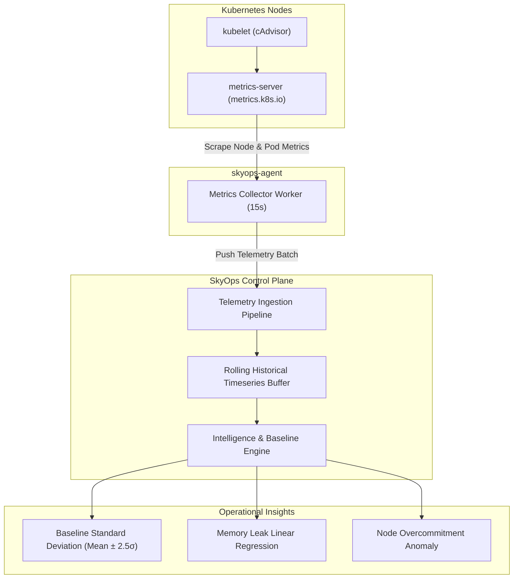

# Metrics Collection & Anomaly Detection

This document details how SkyOps ingests, indexes, and analyzes Kubernetes cluster metrics, maintains historical rollups, computes statistical baselines, and flags anomalous deviations.

---

## Metrics Collection Architecture

SkyOps monitors cluster compute consumption across three hierarchical layers:

1. **Cluster Tier:** Aggregate CPU/Memory capacity, allocatable headroom, and utilization percentages across the entire fleet.
2. **Node Tier:** Per-node usage metrics, allocatable resources, node conditions (`Ready`, `MemoryPressure`, `DiskPressure`, `PIDPressure`), and container density.
3. **Workload / Container Tier:** Per-pod and per-container CPU/Memory usage, comparing live consumption against requested and limited thresholds (`limits` vs `requests` vs `actual`).



---

## Metrics Ingestion Pipeline

### Scrape Frequency & Data Model
- **Interval:** Default every **15 seconds** (`SKYOPS_TELEMETRY_INTERVAL`).
- **Data Model:** Telemetry snapshots contain:
  - Node capacity: CPU cores, RAM bytes, pods allocatable.
  - Node live usage: CPU millicores (`cpuUsage`), memory bytes (`memoryUsage`).
  - Pod container usage: Scraped from `metrics.k8s.io/v1beta1/pods`.
  - Ingress timestamp: Ingested monotonically into the cluster's timeseries buffer.

### Fallback Mode
If `metrics-server` is uninstalled or experiencing an outage, SkyOps automatically triggers a graceful fallback:
- Container CPU and memory are estimated using configured `spec.containers[*].resources.requests` and `limits`.
- The UI displays a warning banner: *"Live metrics-server unavailable; falling back to container request/limit allocations."*
- Cluster node status and pod lifecycle detection remain 100% operational.

---

## Historical Retention & Rolling Baselines

The SkyOps control plane maintains a rolling window of historical metrics points per cluster (`getTelemetryHistory`):

- **Data Retention:** Retains active snapshots in memory, automatically aggregated into rolling timeseries buckets (1-minute, 5-minute, 1-hour).
- **Persistence:** Ingested telemetry points are written to disk during state flushes (`skyops_store.json` under `SKYOPS_DATA_DIR`).

### Statistical Baseline Calculation
The Intelligence Engine (`server/engine/intelligence.ts`) calculates a moving baseline once at least 10 historical snapshots are available:

$$\mu = \frac{1}{N} \sum_{i=1}^{N} x_i$$

$$\sigma = \sqrt{\frac{1}{N} \sum_{i=1}^{N} (x_i - \mu)^2}$$

Where:
- $\mu$ is the rolling mean usage.
- $\sigma$ is the standard deviation.
- Any reading exceeding $\mu + 2.5\sigma$ sustained across two consecutive cycles is flagged as an anomaly.

---

## Detected Anomaly Types

| Anomaly Type | Detection Rule | Root Cause Indication |
| :--- | :--- | :--- |
| **`BASELINE_DEVIATION`** | Metric $> \mu + 2.5\sigma$ sustained for $\ge 30\text{s}$. | Traffic surge, unexpected worker loop, or unoptimized query. |
| **`MEMORY_LEAK_SUSPECTED`** | Monotonically increasing memory slope $> 5\text{MB/min}$ with zero GC reclamation. | Application unreleased references, heap exhaustion. |
| **`NODE_OVERCOMMITMENT`** | $\sum \text{Pod Requests} > \text{Node Allocatable}$. | Risk of node eviction or `OOMKilled` during traffic spikes. |
| **`CPU_THROTTLING_RISK`** | Actual CPU usage reaches $95\%$ of `spec.limits.cpu`. | Container CPU starvation, latency degradation. |

---

## API Endpoints for Metrics

All metrics endpoints require user authentication (`requireUserAuth`) and organization membership:

### 1. Cluster Overview Metrics
```http
GET /api/v1/clusters/:id/metrics
```
Returns summary metrics: total nodes, total pods, aggregate CPU usage, aggregate memory usage.

### 2. Node Metrics
```http
GET /api/v1/clusters/:id/metrics/nodes
```
Returns per-node telemetry:
```json
[
  {
    "nodeName": "node-pool-1",
    "cpuUsageMillicores": 450,
    "cpuCapacityMillicores": 4000,
    "cpuUsagePercentage": 11.25,
    "memoryUsageBytes": 3435973836,
    "memoryCapacityBytes": 16777216000,
    "memoryUsagePercentage": 20.48,
    "ready": true,
    "conditions": {
      "MemoryPressure": false,
      "DiskPressure": false,
      "PIDPressure": false
    }
  }
]
```

### 3. Workload Metrics
```http
GET /api/v1/clusters/:id/metrics/workloads
```
Returns per-workload CPU and memory consumption.

### 4. Historical Metrics Timeseries
```http
GET /api/v1/clusters/:id/metrics/history?range=1h&interval=1m
```
Returns timestamped arrays for charting CPU and memory trends.

### 5. Telemetry Baseline & Anomalies
```http
GET /api/v1/clusters/:id/telemetry/baseline
GET /api/v1/clusters/:id/telemetry/anomalies
```
Returns calculated statistical baselines and currently active anomaly flags.
