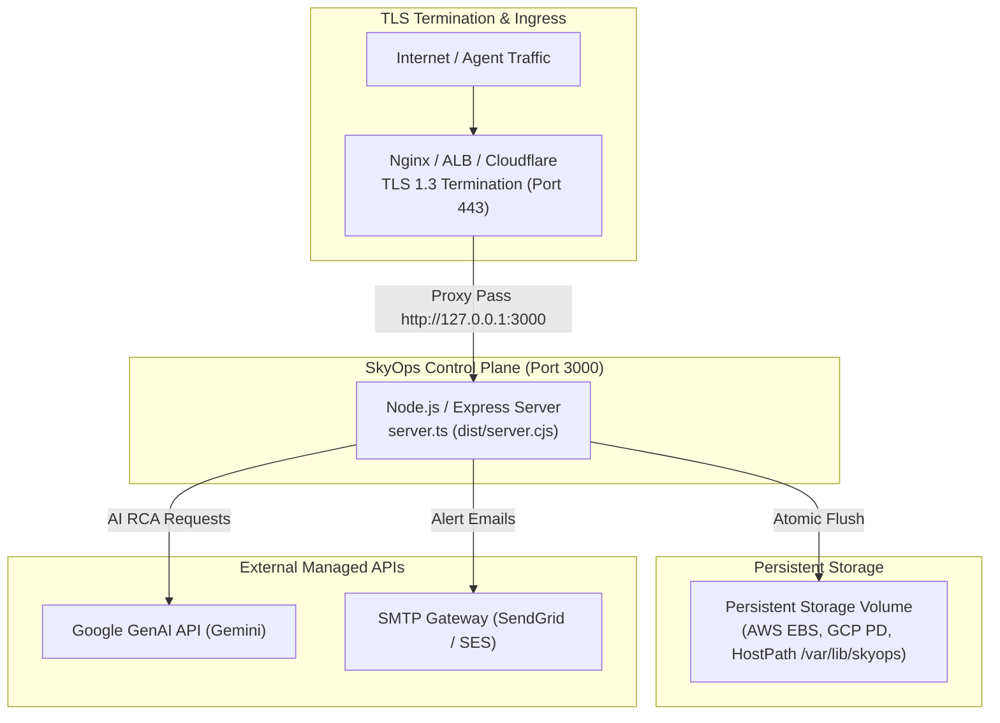

# Production Deployment & Operations

This guide details how to deploy, configure, secure, and operate the **SkyOps Control Plane** in production environments.

---

## Production Architecture & Requirements

In production, the SkyOps Control Plane runs as a stateless Node.js container backed by a persistent storage volume (`SKYOPS_DATA_DIR`) and sits behind a secure TLS reverse proxy (Nginx, Cloudflare, AWS ALB, or Kubernetes Ingress).



---

## Environment Configuration

Create a production `.env` file or inject environment variables via your secrets manager:

```env
# Runtime Environment
NODE_ENV=production
PORT=3000

# Persistent Data Storage (MANDATORY IN PRODUCTION)
# Server refuses to boot if this directory is not mounted and writeable.
SKYOPS_DATA_DIR=/var/lib/skyops

# Authentication & Security
SKYOPS_ALLOW_DEMO_AUTH=false

# Google Gemini AI Integration (Required for AI Root Cause Analysis)
GEMINI_API_KEY=AIzaSy...your-gemini-api-key...
GEMINI_MODEL=gemini-3.1-flash-lite

# Email Alerting Gateway (SMTP)
SKYOPS_SMTP_HOST=smtp.sendgrid.net
SKYOPS_SMTP_PORT=587
SKYOPS_SMTP_SECURE=false
SKYOPS_SMTP_USER=apikey
SKYOPS_SMTP_PASS=SG.your-sendgrid-secret-key
SKYOPS_NOTIFICATION_SENDER_EMAIL=alerts@skyops.yourcompany.com
SKYOPS_NOTIFICATION_SENDER_NAME=SkyOps Production Alerting
```

---

## Option 1: Docker Deployment

### 1. Dockerfile
```dockerfile
FROM node:20-alpine AS builder
WORKDIR /app
COPY package*.json ./
RUN npm ci
COPY . .
RUN npm run build

FROM node:20-alpine AS runner
WORKDIR /app
ENV NODE_ENV=production
COPY --from=builder /app/package*.json ./
COPY --from=builder /app/dist ./dist
COPY --from=builder /app/node_modules ./node_modules
COPY --from=builder /app/server.ts ./server.ts
COPY --from=builder /app/server ./server

RUN mkdir -p /var/lib/skyops && chown -R node:node /var/lib/skyops
USER node
EXPOSE 3000
CMD ["npm", "run", "start"]
```

### 2. Docker Compose
```yaml
version: '3.8'

services:
  skyops:
    image: skyops-control-plane:v1.5.0
    restart: always
    ports:
      - "3000:3000"
    environment:
      - NODE_ENV=production
      - SKYOPS_DATA_DIR=/var/lib/skyops
      - SKYOPS_ALLOW_DEMO_AUTH=false
      - GEMINI_API_KEY=${GEMINI_API_KEY}
      - SKYOPS_SMTP_HOST=${SKYOPS_SMTP_HOST}
      - SKYOPS_SMTP_PORT=587
      - SKYOPS_SMTP_USER=${SKYOPS_SMTP_USER}
      - SKYOPS_SMTP_PASS=${SKYOPS_SMTP_PASS}
    volumes:
      - skyops-storage:/var/lib/skyops

volumes:
  skyops-storage:
    driver: local
```

---

## Option 2: Kubernetes Deployment Manifest

```yaml
apiVersion: v1
kind: Namespace
metadata:
  name: skyops-platform
---
apiVersion: v1
kind: PersistentVolumeClaim
metadata:
  name: skyops-data-pvc
  namespace: skyops-platform
spec:
  accessModes:
    - ReadWriteOnce
  resources:
    requests:
      storage: 20Gi
---
apiVersion: apps/v1
kind: Deployment
metadata:
  name: skyops-server
  namespace: skyops-platform
spec:
  replicas: 1
  strategy:
    type: Recreate # Required for ReadWriteOnce storage volume
  selector:
    matchLabels:
      app: skyops-server
  template:
    metadata:
      labels:
        app: skyops-server
    spec:
      containers:
        - name: server
          image: ghcr.io/skyops-io/skyops-server:v1.5.0
          ports:
            - containerPort: 3000
          env:
            - name: NODE_ENV
              value: "production"
            - name: SKYOPS_DATA_DIR
              value: "/var/lib/skyops"
            - name: SKYOPS_ALLOW_DEMO_AUTH
              value: "false"
            - name: GEMINI_API_KEY
              valueFrom:
                secretKeyRef:
                  name: skyops-secrets
                  key: gemini-api-key
          volumeMounts:
            - name: data-volume
              mountPath: /var/lib/skyops
          livenessProbe:
            httpGet:
              path: /api/health
              port: 3000
            initialDelaySeconds: 15
            periodSeconds: 10
          readinessProbe:
            httpGet:
              path: /api/health
              port: 3000
            initialDelaySeconds: 5
            periodSeconds: 5
      volumes:
        - name: data-volume
          persistentVolumeClaim:
            claimName: skyops-data-pvc
---
apiVersion: v1
kind: Service
metadata:
  name: skyops-service
  namespace: skyops-platform
spec:
  selector:
    app: skyops-server
  ports:
    - port: 80
      targetPort: 3000
```

---

## Nginx Reverse Proxy Configuration

When hosting behind Nginx, configure proper reverse proxy buffering and timeout settings:

```nginx
server {
    listen 443 ssl http2;
    server_name skyops.yourcompany.com;

    ssl_certificate /etc/letsencrypt/live/skyops.yourcompany.com/fullchain.pem;
    ssl_certificate_key /etc/letsencrypt/live/skyops.yourcompany.com/privkey.pem;

    client_max_body_size 10M;

    location / {
        proxy_pass http://127.0.0.1:3000;
        proxy_http_version 1.1;
        proxy_set_header Upgrade $http_upgrade;
        proxy_set_header Connection "upgrade";
        proxy_set_header Host $host;
        proxy_set_header X-Real-IP $remote_addr;
        proxy_set_header X-Forwarded-For $proxy_add_x_forwarded_for;
        proxy_set_header X-Forwarded-Proto $scheme;

        # Allow long-polling and log streaming without premature timeout
        proxy_read_timeout 60s;
        proxy_send_timeout 60s;
    }
}
```

---

## Backup & Disaster Recovery

All state in SkyOps is persisted cleanly in `SKYOPS_DATA_DIR`. To implement automated daily backups:

```bash
#!/bin/bash
BACKUP_DIR="/mnt/backups/skyops"
DATE=$(date +%Y%m%d_%H%M%S)

mkdir -p "${BACKUP_DIR}"

# Archive JSON state files atomically
tar -czf "${BACKUP_DIR}/skyops_backup_${DATE}.tar.gz" -C /var/lib/skyops .

# Retain last 30 daily backups
find "${BACKUP_DIR}" -name "skyops_backup_*.tar.gz" -mtime +30 -delete
```

To restore from backup on a fresh instance:
```bash
tar -xzf skyops_backup_20260917_080000.tar.gz -C /var/lib/skyops
```
Restart the SkyOps server. The `DataStore` will read the restored state at boot.
