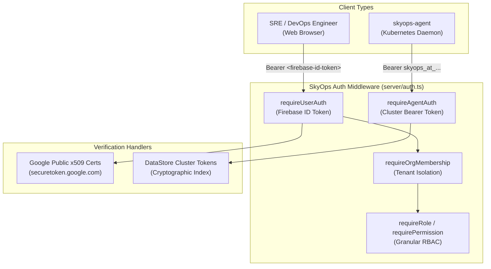

# Authentication, Multi-Tenancy & RBAC

This document details the authentication protocols, multi-tenant isolation model, Role-Based Access Control (RBAC), and fine-grained permission matrix enforced by the SkyOps control plane (`server/auth.ts`).

---

## Authentication Architecture

SkyOps supports two distinct authentication pathways:

1. **User Authentication (Web Console & API):** Authenticated via Firebase ID Tokens signed by Google.
2. **Agent Authentication (Kubernetes Daemons):** Authenticated via cluster-scoped cryptographic Bearer Tokens (`skyops_at_...`).

---

## User Authentication Protocol

1. The frontend authenticates the user via Firebase Auth (Email/Password or Google OAuth).
2. The browser obtains a signed Firebase JWT.
3. Every API call attaches this token in the `Authorization: Bearer <token>` header.
4. The server's `verifyFirebaseIdToken` function verifies the signature using public keys fetched dynamically from:
   `https://www.googleapis.com/robot/v1/metadata/x509/securetoken@system.gserviceaccount.com`
   Public keys are cached in-memory with automatic TTL expiration matching the `Cache-Control` header.
5. In development/testing environments, local demo credentials (`sky_demo_...`) can be enabled via `SKYOPS_ALLOW_DEMO_AUTH=true`. Demo credentials are permanently disabled in production.

---

## Multi-Tenancy & Organization Isolation

All core entities in SkyOps (Clusters, Workloads, Incidents, Policies, Webhooks, and Audit Logs) are strictly partitioned by `orgId`:

- **Active Organization Resolution:** The user's active tenant is resolved from the `X-Org-Id` request header or the user's primary organization membership.
- **Tenant Guard:** The `requireOrgMembership` middleware verifies that the authenticated user holds an `ACTIVE` membership in the requested organization.
- **Zero Cross-Tenant Leakage:** Any attempt to access a cluster or incident belonging to another organization yields an immediate `404 Not Found` or `403 Forbidden`.

---

## Role-Based Access Control (RBAC) Matrix

SkyOps defines five standard enterprise roles:

| Permission Name | Description | OWNER | ADMIN | OPERATOR | ENGINEER | VIEWER |
| :--- | :--- | :---: | :---: | :---: | :---: | :---: |
| `cluster.read` | View clusters, metrics, workloads & nodes | Yes | Yes | Yes | Yes | Yes |
| `cluster.manage` | Add, connect, disconnect, or delete clusters | Yes | Yes | Yes | Yes | No |
| `incident.read` | View incident alerts, details & timelines | Yes | Yes | Yes | Yes | Yes |
| `incident.manage` | Acknowledge, assign, update, or close incidents | Yes | Yes | Yes | Yes | No |
| `remediation.view` | Inspect proposed remediation actions | Yes | Yes | Yes | Yes | Yes |
| `remediation.approve`| Approve queued remediation actions | Yes | Yes | Yes | Yes | No |
| `remediation.execute`| Dispatch mutations to target Kubernetes clusters| Yes | Yes | Yes | Yes | No |
| `policy.manage` | Configure remediation autonomy & namespaces | Yes | Yes | No | No | No |
| `team.manage` | Create teams, manage structure | Yes | Yes | No | No | No |
| `member.manage` | Invite members, change roles, revoke access | Yes | Yes | No | No | No |
| `org.manage` | Update organization settings, name & slug | Yes | Yes | No | No | No |
| `audit.read` | View and export security audit trail logs | Yes | Yes | Yes | Yes | Yes |
| `billing.read` | View platform usage metrics and billing | Yes | Yes | Yes | Yes | Yes |
| `integration.manage`| Configure webhooks and notification channels | Yes | Yes | No | No | No |
| `support.create` | Open platform support tickets | Yes | Yes | Yes | Yes | Yes |
| `support.manage` | Manage and resolve organization support tickets| Yes | Yes | No | No | No |

---

## Agent Version Handshake & Enforced Upgrade

When the agent sends requests to `/api/v1/agent/*`, the server inspects the `X-SkyOps-Agent-Version` header:

- **Supported (`v1.2.0` - `v1.5.0`):** Full feature set active (`X-SkyOps-Agent-Compatibility: SUPPORTED`).
- **Update Recommended (`v1.0.0` - `v1.1.x`):** Compatible, but deprecation notice returned (`X-SkyOps-Agent-Compatibility: UPDATE_RECOMMENDED`).
- **Unsupported (`< v1.0.0`):** Server rejects request with `426 Upgrade Required`.
