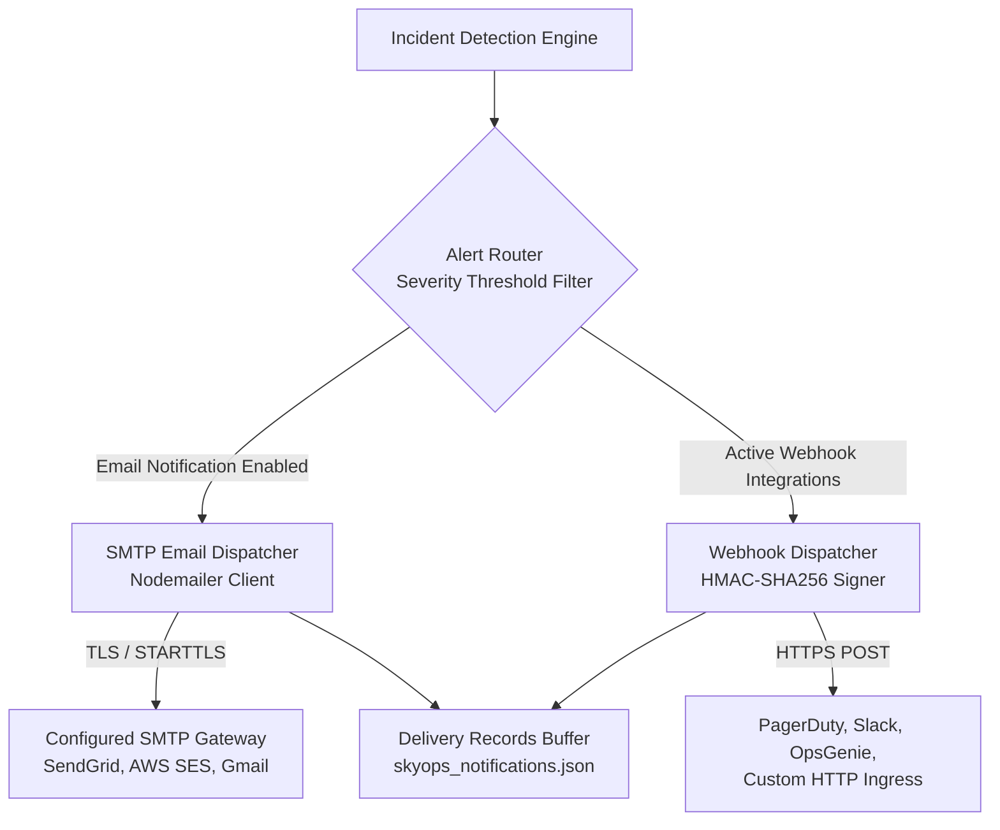

# Notifications & Webhooks

This document details the alerting engine in SkyOps, covering email alerts (SMTP / Nodemailer), outbound Webhook integrations, HMAC-SHA256 signature verification, and delivery auditing.

---

## Alerting Architecture Overview

When an incident is detected or its severity changes, SkyOps routes alert payloads through two primary delivery channels:



---

## Email Notifications (SMTP)

SkyOps provides built-in email alerts formatted with responsive HTML incident summary cards:

### Configuration Environment Variables

| Variable | Type | Default | Description |
| :--- | :--- | :--- | :--- |
| `SKYOPS_SMTP_HOST` | String | `""` | SMTP server hostname (e.g. `smtp.sendgrid.net`). |
| `SKYOPS_SMTP_PORT` | Integer| `587` | SMTP port (`587` for STARTTLS, `465` for SSL/TLS). |
| `SKYOPS_SMTP_SECURE` | Boolean| `false` | Set to `true` for port `465`. |
| `SKYOPS_SMTP_USER` | String | `""` | SMTP username or API key name. |
| `SKYOPS_SMTP_PASS` | String | `""` | SMTP password or API secret key. |
| `SKYOPS_NOTIFICATION_SENDER_EMAIL` | String | `skyopsnetes2000@gmail.com` | From address on outgoing alert emails. |
| `SKYOPS_NOTIFICATION_SENDER_NAME` | String | `SkyOps` | Display name for the sender. |

### Severity Filtering
In the console under **Settings > Notifications**, operators can configure:
- Minimum severity required to trigger an email (`CRITICAL`, `HIGH`, `MEDIUM`, `LOW`).
- Daily digest email toggles.
- Per-user incident subscription preferences.

---

## Outbound Webhooks

Webhooks allow seamless integration into automated paging systems, incident management platforms (PagerDuty, ServiceNow, OpsGenie), and chatops tooling (Slack, Microsoft Teams, Discord).

### Webhook Payload Example

When an incident is opened or updated, SkyOps dispatches a `POST` request with a JSON body:

```json
{
  "event": "incident.created",
  "eventId": "evt-789012",
  "timestamp": 1726562000000,
  "orgId": "org-prod-01",
  "data": {
    "id": "SKY-0042",
    "clusterId": "cluster-a1b2c3d4",
    "clusterName": "prod-us-east-1",
    "namespace": "production",
    "resourceKind": "Pod",
    "resourceName": "auth-service-7f6d97c76-xyz12",
    "incidentType": "CrashLoopBackOff",
    "severity": "HIGH",
    "status": "OPEN",
    "occurrenceCount": 1,
    "title": "Pod auth-service-... in CrashLoopBackOff",
    "summary": "Container 'auth' exited with code 1 due to database connection timeout.",
    "url": "https://skyops.yourcompany.com/incidents/SKY-0042"
  }
}
```

---

## HMAC-SHA256 Signature Verification

To ensure webhooks originate authentically from your SkyOps server and have not been tampered with, every outbound payload includes cryptographic headers:

- `X-SkyOps-Signature`: Hex-encoded HMAC-SHA256 digest of the request body.
- `X-SkyOps-Timestamp`: Millisecond timestamp of the dispatch.

### Verifying Signatures in Node.js:

```typescript
import crypto from 'crypto';

function verifySkyOpsWebhook(
  payloadBody: string,
  receivedSignature: string,
  sharedSecret: string
): boolean {
  const computedSignature = crypto
    .createHmac('sha256', sharedSecret)
    .update(payloadBody, 'utf8')
    .digest('hex');

  return crypto.timingSafeEqual(
    Buffer.from(receivedSignature, 'hex'),
    Buffer.from(computedSignature, 'hex')
  );
}
```

---

## Delivery Auditing & Retry Policy

Every dispatch attempt is recorded in the delivery history:

- **Retries:** Failed deliveries (HTTP 5xx or connection timeouts) are retried up to **3 times** with exponential backoff (`2s`, `4s`, `8s`).
- **Delivery Log Inspection:** Operators can review response status codes, latency, and error strings via:
  ```http
  GET /api/v1/integrations/webhooks/:id/deliveries
  ```
- **Test Webhook Dispatch:** Test end-to-end connectivity without waiting for a real incident via:
  ```http
  POST /api/v1/integrations/webhooks/:id/test
  ```
