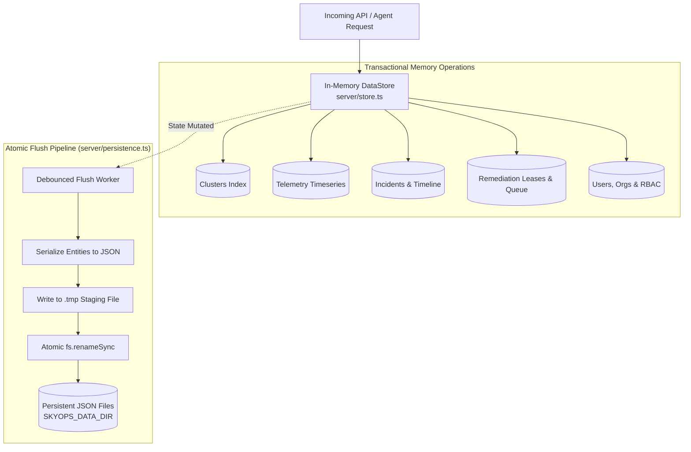

# Storage & Persistence Architecture

This document details the data storage architecture of the SkyOps Control Plane, the authoritative in-memory `DataStore`, atomic file persistence, environment boundaries, and the planned roadmap toward distributed cloud datastores.

---

## Authoritative Storage Model

SkyOps currently utilizes an **in-memory, thread-safe transactional store (`DataStore`)** backed by an **atomic local JSON persistence engine** (`server/persistence.ts` and `server/store.ts`).

---

## Managed Persistence Files

The persistence engine partitions application state across four dedicated JSON files:

| File Name | Contents | Flush Triggers |
| :--- | :--- | :--- |
| `skyops_store.json` | Core entities: Organizations, Users, Clusters, Incidents, Telemetry, Remediation Actions, and Policies. | Cluster updates, incident detection, telemetry rollups. |
| `skyops_audit.json` | Immutable security audit log events (who performed what action, timestamp, IP, outcome). | Every administrative mutation and user login. |
| `skyops_webhooks.json` | Configured outbound webhook endpoints and secret signing keys. | Webhook creation, update, or deletion. |
| `skyops_notifications.json`| Notification settings, email channels, and historical delivery logs. | Alert dispatches and setting modifications. |

---

## Environment Boundaries & Production Guarantees

The `resolvePersistenceConfig()` engine (`server/persistence.ts`) strictly enforces environment safety rules:

### 1. Development (`NODE_ENV=development`)
- Default path: Local repository `./data/` directory.
- Created automatically if missing.

### 2. Automated Testing (`NODE_ENV=test`)
- Directory: Isolated per-process temporary path (e.g. `/tmp/skyops-test-<pid>`).
- Never touches or mutates repository development data.
- Purged after test suites complete.

### 3. Production (`NODE_ENV=production`)
- **Strict Fail-Closed Enforcement:** Production requires an explicit, durable storage directory configured via `SKYOPS_DATA_DIR` (e.g. `SKYOPS_DATA_DIR=/mnt/skyops-data`).
- **Zero Ephemeral Fallback:** If `SKYOPS_DATA_DIR` is missing or empty, the server **refuses to start**, preventing silent data loss upon container restart.
- **Active Startup Probe:** On boot, the server writes and deletes an active probe file (`.probe-write-<pid>-<timestamp>`) in the designated directory. If unwriteable, boot halts immediately with a fatal error.

---

## Crash Resilience & Atomic Writes

To prevent file corruption during sudden server restarts or hardware power interruptions, SkyOps never writes directly to active `.json` files:

1. The serialized payload is written to a temporary sibling file:
   `skyops_store.json.tmp.<pid>.<timestamp>`
2. All bytes are flushed and synced to disk.
3. The temporary file is renamed over the target file using POSIX-atomic `fs.renameSync()`.
4. If the process crashes mid-write, the existing `.json` file remains 100% intact.

---

## Datastore Evolution & Roadmap

### Current Status vs. Future Architecture

| Dimension | Current Implementation (v1.5.0) | Planned Production Evolution |
| :--- | :--- | :--- |
| **Server Persistence** | In-memory `DataStore` + atomic JSON file persistence (`SKYOPS_DATA_DIR`). | Distributed Cloud Firestore or PostgreSQL / CockroachDB. |
| **Authentication Store** | Firebase Authentication (client SDK + Google x509 token verification). | Fully unified enterprise IdP / SAML / OIDC. |
| **High Availability** | Single-instance server with mounted persistent volume. | Multi-replica active-active with distributed locking. |
| **Horizontal Scaling** | Single control plane node handles up to 50 clusters. | Sharded cluster ingestion workers over Kafka/NATS. |

*Note: While `firebase-blueprint.json` and client-side `src/firebase.ts` are configured for Firebase Authentication and user management, the server-side authoritative state is currently managed by `DataStore` with local JSON persistence.*
