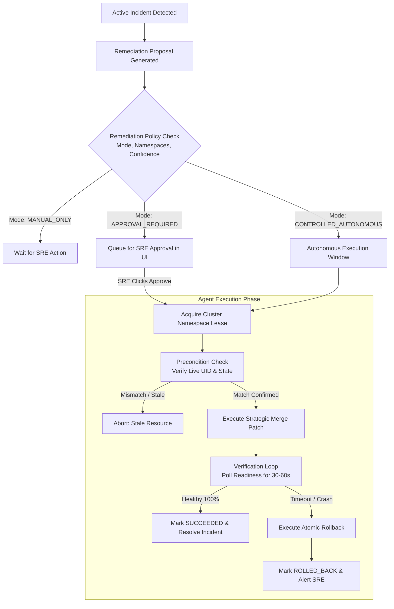

# Automated Remediation Engine

This document details the architecture, safety policies, execution flow, verification loops, and rollback mechanisms of the **SkyOps Remediation Engine** (`server/engine/policy.ts` and `agent/internal/remediation/*`).

---

## Remediation Philosophy: Safety First

Mutating running production Kubernetes workloads carries inherent operational risk. SkyOps implements a multi-layered safety architecture designed around the principle of **Guaranteed Reversibility**:

1. **Explicit Policy Modes:** Organizations choose between `MANUAL_ONLY`, `APPROVAL_REQUIRED`, or `CONTROLLED_AUTONOMOUS` modes.
2. **Cluster Action Leases:** Distributed mutex leases prevent concurrent conflicting mutations on the same namespace or workload.
3. **Pre-condition Validation:** The agent validates live resource versions and UIDs before touching any cluster resource.
4. **Automated Convergence Verification:** The agent actively monitors workload rollout status for up to 60 seconds post-mutation.
5. **Atomic Rollback:** If the target does not achieve a healthy state within the verification timeout, the agent immediately reverts the change to the pre-execution snapshot.



---

## Supported Remediation Action Types

The SkyOps Agent (`agent/internal/remediation/executor.go`) implements three hardened mutation primitives:

### 1. `ReplacePodImage`
- **Use Case:** Rolling back a bad deployment version or applying a hotfix tag.
- **Deployment Target:** Applies a Strategic Merge Patch:
  ```json
  {
    "spec": {
      "template": {
        "spec": {
          "containers": [
            {
              "name": "api",
              "image": "registry.corp/api:v2.1.4"
            }
          ]
        }
      }
    }
  }
  ```
- **Pre-condition Check:** Verifies that `spec.template.spec.containers[x].image` matches `expectedCurrentValue`.
- **Rollback:** Restores original image string if the new deployment fails readiness probes.

### 2. `RestartPod`
- **Use Case:** Clears deadlock states, unblocks stuck connections, or forces configuration re-reads.
- **Deployment Target:** Applies an RFC3339 timestamp annotation to `spec.template.metadata.annotations["kubectl.kubernetes.io/restartedAt"]`, triggering a zero-downtime rolling restart.
- **Standalone Pod Target:** Issues `DELETE` against the pod; the parent ReplicaSet or DaemonSet controller re-provisions a fresh pod instance.

### 3. `ScaleDeployment`
- **Use Case:** Relieves temporary traffic saturation by adding replicas or scales down a stuck replica.
- **Target:** Patches `spec.replicas` to the proposed integer.
- **Rollback:** Restores `spec.replicas` to the recorded baseline count.

---

## Remediation Policy Configuration

Remediation behavior is governed per organization or per cluster (`RemediationPolicy` in `src/types/index.ts`):

```json
{
  "orgId": "org-prod-01",
  "clusterId": "cluster-a1b2c3d4",
  "remediationMode": "APPROVAL_REQUIRED",
  "allowedActionTypes": ["RestartPod", "ReplacePodImage", "ScaleDeployment"],
  "allowedNamespaces": ["production", "staging"],
  "maxRiskLevel": "MEDIUM",
  "requireHighConfidence": true,
  "minConfidenceThreshold": 0.85,
  "maxAttemptsPerIncident": 2,
  "maxActionsPerHourPerCluster": 10,
  "telemetryFreshnessThresholdMs": 60000,
  "actionExpirationMs": 300000,
  "leaseTimeoutMs": 120000
}
```

### Protected Namespaces
Automated mutations are strictly forbidden in critical infrastructure namespaces:
- `kube-system`
- `kube-public`
- `kube-node-lease`
- `skyops-system` / `skyops`

Attempts to dispatch remediation actions targeting these namespaces fail immediately with `403 Forbidden: Action target resides in protected namespace`.

---

## API Endpoints for Remediation

### 1. View Proposed Remediation for an Incident
```http
GET /api/v1/incidents/:id/remediation
Authorization: Bearer <user-jwt>
```

### 2. Approve & Execute Remediation Action
```http
POST /api/v1/incidents/:id/remediations/replace-pod-image/approve
Authorization: Bearer <user-jwt>
Content-Type: application/json

{
  "proposedValue": "my-app:v1.2.3"
}
```
*Requires role `OWNER`, `ADMIN`, or `ENGINEER` (`remediation.approve` and `remediation.execute` permissions).*

### 3. Fetch Remediation Audit Trail
```http
GET /api/v1/incidents/:id/remediation/audit
Authorization: Bearer <user-jwt>
```
Returns complete history: who approved the action, timestamps, pre-execution values, live execution outputs, and verification status.
