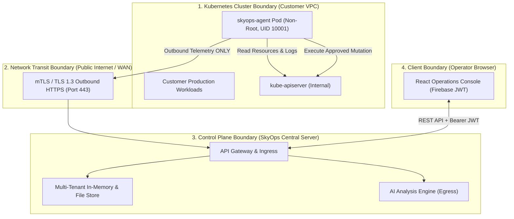

# Security Model & Threat Assessment

This document outlines the security architecture, threat model, trust boundaries, data protection controls, and cluster hardening standards for the SkyOps platform.

---

## Trust Boundaries & Network Topology

SkyOps is engineered under a zero-trust model, establishing distinct trust boundaries across four runtime environments:



### Critical Security Invariant: Outbound-Only Communication
- The SkyOps Agent **never listens on open inbound network ports**.
- The cluster's firewall requires zero incoming port forwards, load balancers, or ingress controllers for SkyOps.
- If the control plane is compromised, an attacker cannot pivot inward to initiate network connections into customer clusters.

---

## Threat Model & Mitigations

| Threat | Attack Vector | SkyOps Hardening & Countermeasure |
| :--- | :--- | :--- |
| **Cluster Ingress Compromise** | Attacker probes for open cluster ports. | **Mitigated:** No open ingress ports on cluster. All traffic is outbound initiated by agent via HTTPS. |
| **Agent Token Compromise** | Stolen `skyops_at_...` bearer token. | **Mitigated:** Token only grants rights to post telemetry and retrieve designated cluster actions. Cannot read other clusters. Tokens can be revoked or rotated instantly via UI/API. |
| **Unauthorized Workload Mutation** | Rogue action attempts to delete cluster or wipe storage. | **Mitigated:** RBAC strictly forbids namespace/PVC deletion. System namespaces (`kube-system`, etc.) are protected. Pre-condition checks and atomic rollbacks prevent destructive drift. |
| **Cross-Tenant Data Leakage** | Malicious user attempts to query another organization's incidents. | **Mitigated:** Middleware enforces `requireOrgMembership` on every API route. DataStore queries strictly enforce `orgId` filtering. |
| **Secret Exfiltration via Pod Logs** | Passwords or private keys streamed into LLM prompts. | **Mitigated:** The agent and control plane pass logs through regex sanitizers that strip bearer tokens, private keys, and environment variables matching secret patterns. |
| **Prompt Injection Attacks** | Malicious payload in pod log attempts to hijack AI output. | **Mitigated:** LLM output is validated against a rigid JSON schema by `SafetyPolicyEngine`. The AI has zero execution privileges and cannot directly trigger cluster mutations. |

---

## Agent Hardening & Container Security

The official `skyops-agent` container is packaged and executed with defense-in-depth controls:

```yaml
securityContext:
  allowPrivilegeEscalation: false
  readOnlyRootFilesystem: true
  runAsNonRoot: true
  runAsUser: 10001
  runAsGroup: 10001
  capabilities:
    drop:
      - ALL
```

### Explanations:
1. **`runAsNonRoot: true` & `runAsUser: 10001`:** The agent binary executes under an unprivileged UID with zero root access on the host node.
2. **`allowPrivilegeEscalation: false`:** Prevents child processes from gaining setuid privileges.
3. **`readOnlyRootFilesystem: true`:** The container root filesystem cannot be modified. Ephemeral disk writes are isolated to an `emptyDir` mounted at `/var/spool/skyops-agent` and `/tmp`.
4. **`capabilities.drop: ["ALL"]`:** Removes all Linux kernel capabilities (including `CAP_NET_RAW`, `CAP_SYS_ADMIN`, `CAP_DAC_OVERRIDE`).

---

## RBAC Least Privilege

The Kubernetes ClusterRole assigned to the agent (`skyops-agent-reader`) is bounded:
- **Read-Only:** Nodes, Namespaces, Services, ConfigMaps, Secrets, PVCs, StorageClasses, and Events.
- **Controlled Mutation:** Limited strictly to:
  - `pods`: `create`, `delete` (for replacing standalone crashed pods).
  - `deployments`: `patch` (for rolling image updates and replica scaling).
- **Prohibited:** Cannot delete Namespaces, PersistentVolumes, Nodes, RBAC Roles, or mutating webhook configurations.

---

## Data Protection & Encryption

- **Data in Transit:** All communication between agents, control planes, and browsers is encrypted using **TLS 1.3** (or TLS 1.2 minimum) with modern cipher suites.
- **Data at Rest:** Control plane persistence files (`SKYOPS_DATA_DIR`) reside on encrypted persistent volumes (e.g. AWS EBS with KMS, GCP Persistent Disk with customer-managed keys).
- **Audit Logging:** Every user action (login, token rotation, remediation approval, policy update) generates an immutable entry in `skyops_audit.json` recording user UID, role, timestamp, client IP, and operation outcome.
